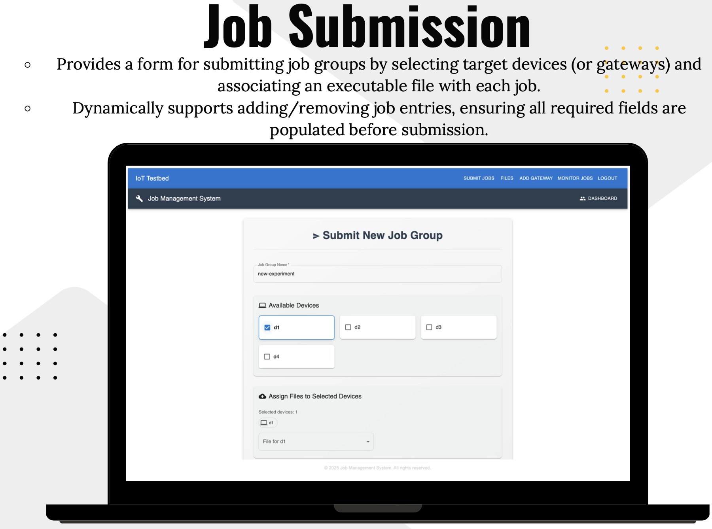

### Backend
- `pip install requirements.txt` (ideally in venv)
- to run server - `uvicorn app.main:app --reload`
- access docs at - `locahost:8000/docs`

### Frontend
- `npm install` - to install deps
- `npm run dev` - to start frontend

### link for Gateway
https://github.com/utkarshpatel7356/iot_gateway

